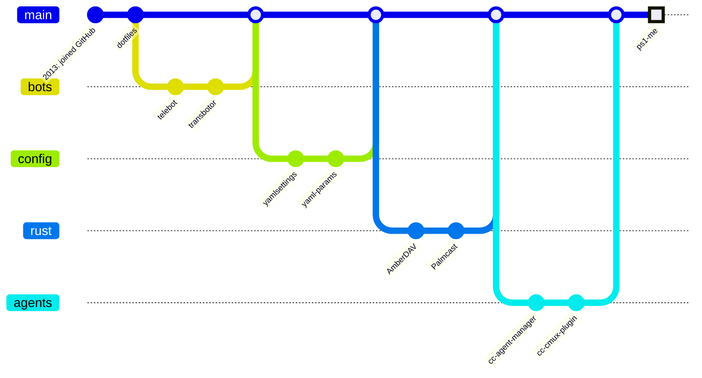

# 🎰 15 Profile Concepts — pick one, delete the rest

---

## 1 · PS1 Memory Card

<p align="center">
  <a href="https://raw.githubusercontent.com/KyleJamesWalker/KyleJamesWalker/main/assets/memory-card.svg"></a>
</p>

<p align="center"><sub>Insert disc 2 to continue · ps1-me avatar coming soon to a polygon near you</sub></p>

---

## 2 · neofetch

```text
kyle@github:~$ neofetch
        ▄▄▄▄▄▄▄          kyle@github
      ▄█▀     ▀█▄        -----------
     ▐█  K J W  █▌       OS ........ Los Angeles, CA
     ▐█         █▌       Uptime .... 13 years (since Feb 2013)
      ▀█▄     ▄█▀        Height .... 6'3" (yes, I can reach the top shelf)
        ▀▀▀▀▀▀▀          Shell ..... zsh, inside cmux, inside Claude Code
                         Langs ..... Python · Rust · TypeScript · a little C
                         Repos ..... 70 public
                         Stars ..... ★ 100+ and counting
                         Keyboard .. ErgoDox Infinity, 40% layout
                         Packages .. telebot, yamlsettings, Palmcast, AmberDAV
kyle@github:~$ █
```

---

## 3 · Choose Your Own Adventure

> You wake up in a repository. It is dark. A lone `README.md` glows faintly.
> To the **north**, a Telegram bot hums. To the **east**, a Rust crab guards a WebDAV server.
> A YAML scroll lies at your feet.

| | | |
|:-:|:-:|:-:|
| [⬆️ **Go north**](https://github.com/KyleJamesWalker/KyleJamesWalker/issues/new?title=adventure%7Cnorth&body=Just+push+%27Submit+new+issue%27.) | [📜 **Read the scroll**](https://github.com/KyleJamesWalker/KyleJamesWalker/issues/new?title=adventure%7Cscroll&body=Just+push+%27Submit+new+issue%27.) | [➡️ **Go east**](https://github.com/KyleJamesWalker/KyleJamesWalker/issues/new?title=adventure%7Ceast&body=Just+push+%27Submit+new+issue%27.) |

<sub>Every move opens an issue. A future GitHub Action reads it, advances the story, and rewrites this section. Last move: *nobody yet — be the first.*</sub>

---

## 4 · Character Sheet

| | |
|---|---|
| **Name** | Kyle James Walker |
| **Class** | Level 13 Bot Wrangler / Multiclass Rustacean |
| **Alignment** | Lawful YAML |
| **Height** | 6'3" — advantage on high shelves, disadvantage on airplane seats |
| **Home base** | Los Angeles |

| STR | DEX | CON | INT | WIS | CHA |
|:---:|:---:|:---:|:---:|:---:|:---:|
| 12 | 16 | 14 | 17 | 15 | 13 |

**Inventory:** ErgoDox Infinity (+2 to typing) · Cursed Tome of Config (`yamlsettings`) · Telegram Familiar (`telebot`) · Pocket Projector (`Palmcast`)

**Feats:** *Agent Whisperer* — may command several Claude Code agents per turn. *Review Gate* — may pin an AST node so no one passes without an SME's blessing (`keystones`).

---

## 5 · `man kyle`

```text
KYLE(1)                       User Commands                       KYLE(1)

NAME
       kyle - turns coffee and YAML into tools other people use

SYNOPSIS
       kyle [--build] [--automate] [--rust] [--overthink] PROBLEM

DESCRIPTION
       Builds small, sharp tools: GitHub Actions, Telegram bots, config
       loaders, speaker timers, and plugins that babysit AI agents.

OPTIONS
       --build      Default. Cannot be disabled.
       --automate   Anything done twice gets a script.
       --rust       Rewrites it in Rust. Usually for fun.
       --overthink  Undocumented. Enabled by default.

BUGS
       Will start a new side project before finishing the last one.

SEE ALSO
       telebot(1), yamlsettings(3), palmcast(1), amberdav(8)

Los Angeles                        2013                           KYLE(1)
```

---

## 6 · Profile as Config

```yaml
# kyle.yaml — loaded with yamlsettings, obviously
kyle:
  location: Los Angeles, CA
  pronouns: he/him
  height_m: 1.905
  languages: [python, rust, typescript]
  currently:
    building: a PS1-style low-poly avatar of myself
    tinkering: Claude Code plugins, cmux, Godot
  favorite_repos:
    - telebot             # ★53
    - pr-changes-matrix-builder
    - yamlsettings
  side_projects: !!int 9001
  sleep: null
```

---

## 7 · High Scores

```text
╔══════════════════════════════════════════╗
║          ★  H I G H   S C O R E S  ★     ║
╠════╦═══════════════════════════╦═════════╣
║ 1. ║ TELEBOT                   ║  53 ★   ║
║ 2. ║ PR-CHANGES-MATRIX-BUILDER ║  20 ★   ║
║ 3. ║ YAMLSETTINGS              ║  18 ★   ║
║ 4. ║ VSCODE-CC-AGENT-MANAGER   ║   7 ★   ║
║ 5. ║ QMK-ERGODOX-INFINITY      ║   3 ★   ║
║ 6. ║ CC-CMUX-PLUGIN            ║   2 ★   ║
╠════╩═══════════════════════════╩═════════╣
║   INSERT ⭐ TO CONTINUE ......  CREDIT 0  ║
╚══════════════════════════════════════════╝
```

---

## 8 · Patch Notes

### Kyle v13.7.0 — *"Tall Polygons"*

**✨ New**
- Low-poly PS1 avatar of self, driven by webcam (beta, may T-pose)
- `keystones`: review gates pinned to AST nodes
- `Palmcast`: give a talk from your phone at a bar

**🐛 Fixed**
- Telegram bot no longer the only thing people star

**⚠️ Known issues**
- Side-project count overflowing `int32`
- Still says "one more feature" at 1 a.m.

---

## 9 · Trading Card

<table align="center"><tr><td align="center" width="340">

**KYLE JAMES WALKER** &nbsp; `HP 190`

🌴 ⚡ *Type: Builder / Automator*

```text
   ┌──────────────────────┐
   │      ▄▀▀▀▀▀▄         │
   │     █ ◕   ◕ █  6'3"  │
   │     █   ▽   █        │
   │      ▀▄▄▄▄▄▀         │
   └──────────────────────┘
```

**⚡ YAML Surge** — `20` <br>
<sub>Load every setting from every file at once.</sub>

**🤖 Summon Bot** — `53` <br>
<sub>Call a Telegram familiar. It never sleeps.</sub>

<sub>Weakness: "quick" side projects ×2 · Retreat: ☕☕</sub>

</td></tr></table>

---

## 10 · Life as a git graph



---

## 11 · Today's Forecast — Los Angeles

| | Mon | Tue | Wed | Thu | Fri |
|---|:-:|:-:|:-:|:-:|:-:|
| | ☀️ | ☀️ | 🌤️ | ☀️ | 🌋 |
| **Commits** | 12 | 8 | 15 | 4 | 31 |
| **Coffee** | ☕☕ | ☕ | ☕☕☕ | ☕ | ☕☕☕☕ |
| **YAML** | 100% | 100% | 100% | 100% | 100% |

> [!WARNING]
> Friday: severe side-project advisory in effect. New repos may form without warning.

---

## 12 · The Menu

<div align="center">

### 🍽️ Café Kyle
*Est. 2013 · Los Angeles*

**Starters**<br>
Telegram Bot Bites ······ `telebot`<br>
YAML Carpaccio ······ `yamlsettings`

**Mains**<br>
Matrix-Built PR Platter ······ `pr-changes-matrix-builder`<br>
Slow-Roasted Rust WebDAV ······ `AmberDAV`<br>
Agent Manager Tasting Menu ······ `vscode-cc-agent-manager`

**Dessert**<br>
Low-Poly Self-Portrait, served at 128×128 ······ *chef's special*

<sub>All dishes contain nuts and bolts. Gluten-free, bug-tolerant.</sub>

</div>

---

## 13 · Easter Egg Hunt

Hi, I'm Kyle 👋 I build things.

<details><summary>Click for more</summary>

I mostly build bots, GitHub Actions and Rust tools.

<details><summary>Click for even more</summary>

I'm building a PS1-style avatar of myself that copies me through my webcam.

<details><summary>You're still clicking?</summary>

I'm 6'3". The avatar is also 6'3". It's 1.905 m of 128×128 textures.

<details><summary>Okay, last one, really</summary>

🥚 You found the egg. [Tell me you found it](https://github.com/KyleJamesWalker/KyleJamesWalker/issues/new?title=%F0%9F%A5%9A+found+it).

</details>
</details>
</details>
</details>

---

## 14 · The Classic Dashboard

<p align="center">
  <a href="https://git.io/typing-svg"></a>
</p>

<p align="center">
  
  
</p>

<p align="center">
  
  
  
  
  <a href="http://www.KyleJamesWalker.com"></a>
</p>

---

## 15 · Haiku Wall

> *YAML at sunrise —*<br>
> *indentation holds the world.*<br>
> *one tab breaks it all.*

> *Telegram bot wakes,*<br>
> *fifty-three stars in the dark.*<br>
> *It never says thanks.*

> *Tall man, low polygons,*<br>
> *the webcam blinks — and he waves*<br>
> *in 1999.*

<sub>New haiku every Monday, written by a cron job with feelings.</sub>
